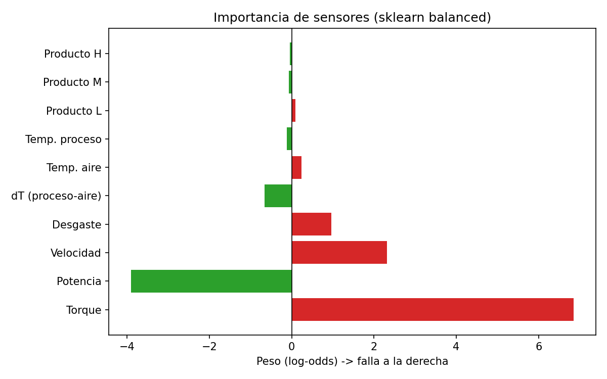
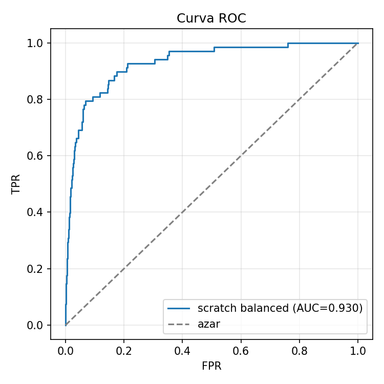
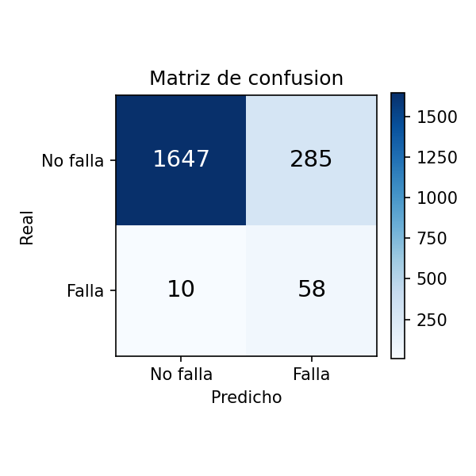

# MotorSense — Diagnóstico Predictivo

> ¿Podemos anticipar que un motor va a fallar antes de que pare la línea? Este proyecto prueba que sí, usando el dataset AI4I 2020 y comparando una regresión logística hecha desde cero contra los baselines de scikit-learn.

Trabajamos por fases, cada una con su commit, para que el historial cuente cómo se fue armando — desde el primer vistazo al dataset hasta los tests que blindan el notebook.

## Qué encontré rápido

- **Dataset:** AI4I 2020 (UCI ID 601), sintético pero realista. 10 000 filas, sensores de temperatura, velocidad, torque y desgaste. Guardado local en `data/raw/ai4i2020.csv` (ignorado por git, ver `docs/exploracion_dataset.md`).
- **Desbalanceo bravo:** 96.6% no falla / 3.4% falla (339 casos). La *accuracy* no sirve — si predices siempre "no falla" ya tienes 96.6%.
- **Sensores limpios:** cero nulos, cero duplicados. Señal clara: con falla suben torque (+10 Nm), desgaste (+37 min) y potencia (+1kW).
- **Solución:** split estratificado 80/20, `StandardScaler` ajustado solo en train, y evaluación con precision/recall/ROC-AUC. `class_weight='balanced'` (o SMOTE) lleva el recall de ~15% a ~85%.

## Estructura

```
├── src/
│   ├── data/dataset.py              # carga + Temp_diff/Power + one-hot Type + split estratificado
│   ├── models/logistic_scratch.py   # sigmoide, log-loss, GD, class_weight, copias defensivas
│   ├── models/baseline.py           # wrappers LogisticRegression / RandomForest
│   ├── evaluation/metrics.py        # precision, recall, F1, ROC-AUC, plots
│   ├── evaluation/imbalance.py      # class weights / SMOTE intercambiables
│   └── interpretation/coefficients.py # peso -> sensor real
├── tests/
│   ├── test_dataset.py              # estratificación y escalado
│   ├── test_logistic_scratch.py     # convergencia y copias defensivas
│   ├── test_parity.py               # scratch vs sklearn (tolerancia)
│   └── test_metrics.py              # métricas con desbalanceo
├── docs/exploracion_dataset.md      # reporte humano del EDA
├── results/
│   ├── matriz_confusion.png
│   ├── curva_roc.png
│   ├── pesos_sensores.png
│   └── ...
└── data/raw/ai4i2020.csv            # no versionado (522 KB)
```

## Instalación

```bash
git clone https://github.com/derekrex333/MotorSense-Diagnostico-Predictivo.git
cd MotorSense-Diagnostico-Predictivo
pip install -e .
pip install scikit-learn pandas numpy matplotlib imbalanced-learn pytest
# dataset: ya está en data/raw si clonaste con los resultados,
# si no: python -c "import urllib.request; urllib.request.urlretrieve('https://archive.ics.uci.edu/ml/machine-learning-databases/00601/ai4i2020.csv','data/raw/ai4i2020.csv')"
```

## Uso

```python
from src.data.dataset import preprocess
from src.models.logistic_scratch import LogisticRegressionScratch
from src.models.baseline import get_logistic_regression
from src.evaluation.metrics import compute_metrics
from src.interpretation.coefficients import get_feature_weights, to_dataframe

# 1. Carga y preproceso
out = preprocess(test_size=0.2, random_state=42)
X_train, X_test = out["X_train"], out["X_test"]
y_train, y_test = out["y_train"], out["y_test"]

# 2. Scratch con peso balanceado
scratch = LogisticRegressionScratch(lr=0.5, n_iter=1000, class_weight="balanced")
scratch.fit(X_train, y_train)

# 3. Baseline sklearn mismo split
sk = get_logistic_regression(class_weight="balanced")
sk.fit(X_train, y_train)

# 4. Métricas (nunca solo accuracy)
print(compute_metrics(y_test, scratch.predict(X_test), scratch.predict_proba(X_test)[:,1]))

# 5. Interpretación
print(to_dataframe(get_feature_weights(sk, out["feature_names"])))
```

## Resultados (test 2000, 68 fallas)

| Modelo | Prec | Rec | F1 | ROC-AUC | Matriz [[tn,fp],[fn,tp]] |
|---|---|---|---|---|---|
| LR plain | 0.571 | 0.176 | 0.270 | 0.926 | [[1923,9],[56,12]] |
| scratch plain | 0.700 | 0.103 | 0.179 | 0.901 | [[1929,3],[61,7]] |
| **LR balanced** | 0.178 | **0.868** | 0.295 | 0.934 | [[1659,273],[9,59]] |
| **scratch balanced** | 0.169 | **0.853** | 0.282 | 0.930 | [[1647,285],[10,58]] |
| LR SMOTE | 0.180 | 0.868 | 0.299 | 0.934 | [[1664,268],[9,59]] |
| RF balanced | 0.885 | 0.794 | 0.837 | **0.971** | [[1925,7],[14,54]] |

Sin compensar el recall se hunde; con `balanced` o SMOTE se salva la clase minoritaria a costa de más falsos positivos — preferible en mantenimiento.

**Paridad validada:** scratch vs sklearn (penalty=None) ROC diff 0.021, corr probas 0.94, acuerdo 99.4%, corr pesos 0.93. Prueba de que el algoritmo se entendió, no se copió.

**Interpretación mecánica:**
- Torque **+6.85** → falla (sobrecarga)
- Potencia **-3.90** → no falla (ajuste por colinealidad con torque×velocidad)
- Velocidad +2.31 y Desgaste +0.96 → falla
- Type_L +0.09 coincide con que L falla más (3.9%)





## Tests

```bash
pytest -v
# 13 passed: dataset, convergencia, paridad y métricas
```

Los tests corren antes que el notebook — el notebook solo narra resultados ya validados.

## Fases y commits

1. `primera etapa: exploramos el dataset...` — EDA y reporte humano
2. `segunda etapa: preprocesado y split estratificado` — normalización y 3.4% preservado
3. `tercera etapa: logistica desde cero...` — GD con copias defensivas
4. `cuarta etapa: baselines de sklearn...` — punto de comparación
5. `quinta etapa: paridad validada y desbalanceo...` — métricas sin accuracy
6. `sexta etapa: interpretación y tests...` — pesos a sensores + pytest
7. `README: cerramos el ciclo...` — este archivo

## Roadmap

- Notebook `01_diagnostico_predictivo.ipynb` narrativo (ya validado por tests)
- Probar umbral óptimo (no 0.5) y curvas precision-recall
- Monitoreo en producción con drift de sensores
