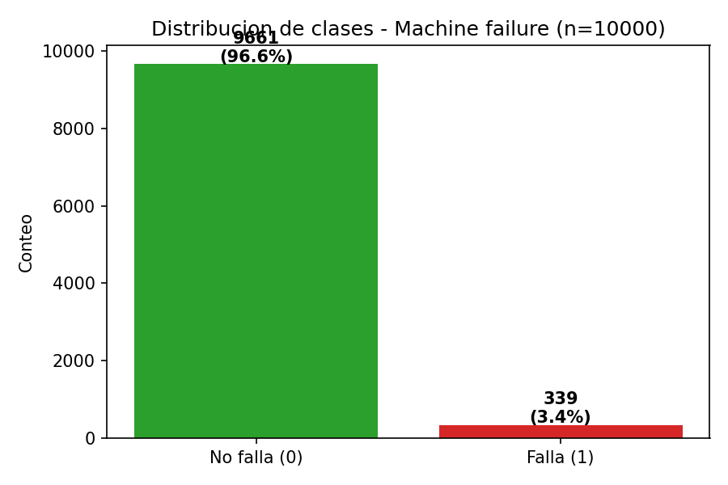
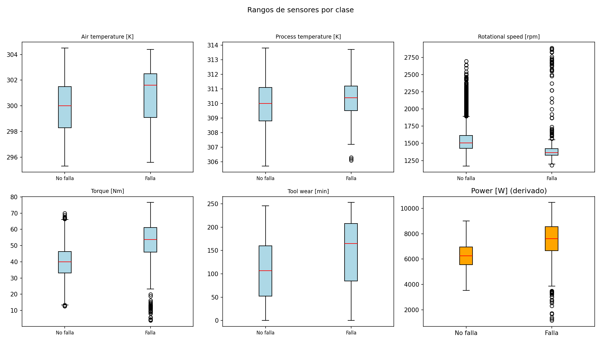
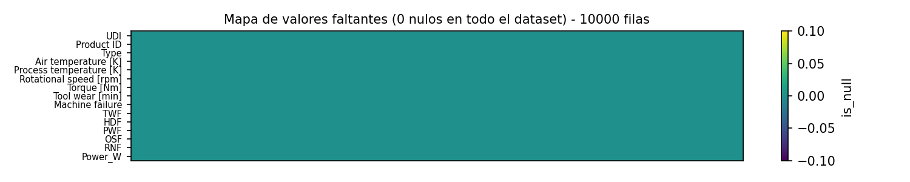
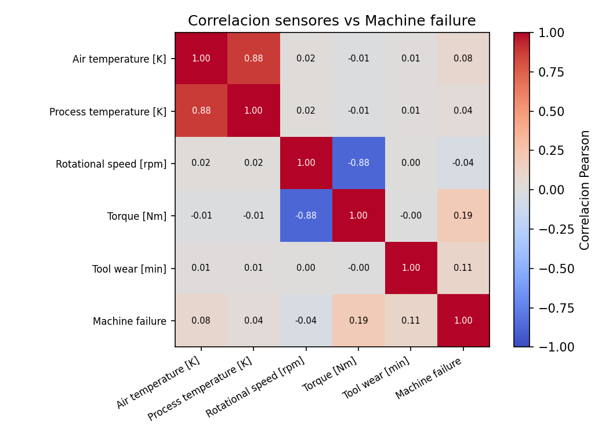

# Primer vistazo al dataset — AI4I 2020

Bajé el dataset de UCI (ID 601, el famoso AI4I 2020 de mantenimiento predictivo). Es sintético pero está hecho para parecerse a datos reales de fábrica, así que nos sirve perfecto para probar el diagnóstico de falla.

Lo dejé guardado en `data/raw/ai4i2020.csv` — son 10 mil filas y 14 columnas, pesa poquito (522 KB). Viene con `.gitignore` para no subir los CSV al repo, pero acá documento todo lo que encontré antes de tocar cualquier modelo.

## Qué trae el dataset

Cada fila es una pieza/momento de una máquina:

- `UDI` y `Product ID` — identificadores, no aportan al modelo.
- `Type` — L, M o H (calidad del producto). L son 6 mil, M casi 3 mil, H mil y cacho.
- Sensores reales: temperatura del aire, temperatura del proceso, velocidad de giro, torque y desgaste de herramienta.
- `Machine failure` — nuestro target, 0 = todo bien, 1 = falló.
- Y cinco columnas extra de tipo de falla: TWF, HDF, PWF, OSF, RNF (cuando falla, a veces indica por qué).

## Lo más importante: está muy desbalanceado

Este fue el primer susto al contar:

- 9,661 sin falla (96.6%)
- 339 con falla (3.4%)

O sea, de cada 29 piezas buenas, una falla. Si haces un modelo tonto que siempre dice "no falla", ya tienes 96.6% de accuracy y no sirve para nada.

Por tipo de producto también se nota: las L fallan más (3.9%), luego M (2.8%) y H (2.1%). De las 339 fallas, 235 son de tipo L.

Revisé los subtipos de falla y hay algo raro: 18 casos tienen un subtipo marcado pero `Machine failure = 0`, y 9 al revés. Es poquito (0.27% del total), parece ruido del generador sintético, pero lo dejo anotado para no usar esos subtipos como target principal. Por ahora nos quedamos solo con `Machine failure`.

Esto nos obliga a hacer las cosas bien desde el inicio: split estratificado, y medir con precisión, recall y ROC-AUC, no con accuracy. Más adelante probaremos `class_weight` y SMOTE.

## Cómo se mueven los sensores

Hice un resumen rápido de rangos:

| Sensor | Rango | Promedio |
|---|---|---|
| Aire [K] | 295.3 – 304.5 | 300.0 ± 2.0 |
| Proceso [K] | 305.7 – 313.8 | 310.0 ± 1.48 |
| Velocidad [rpm] | 1,168 – 2,886 | 1,538 ± 179 |
| Torque [Nm] | 3.8 – 76.6 | 40.0 ± 9.97 |
| Desgaste [min] | 0 – 253 | 108 ± 63.7 |

También saqué dos features que suelen ayudar: `Temp_diff` (proceso - aire, entre 7.6 y 12.1K) y `Power` (torque × velocidad, entre 1,148 y 10,470 W).

Cuando separé por falla vs no falla se ve dónde está la señal:

- Con falla el torque sube en promedio 10 Nm (50.2 vs 39.6) y el desgaste 37 minutos (143 vs 106).
- La potencia también se dispara: 7,283W vs 6,244W.
- La velocidad baja un poco (-44 rpm) y la diferencia de temperatura baja 0.6K.

En medianas es aún más claro: desgaste 165 vs 107, torque 53.7 vs 39.9. No es magia, pero hay patrón.

Revisé outliers con IQR: velocidad tiene 4.1% fuera de rango y torque 0.7%. No los voy a quitar todavía — en mantenimiento esos picos pueden ser justo el aviso de que algo va a fallar.

## ¿Faltan datos?

No. Cero nulos en las 14 columnas, cero duplicados. Al ser sintético viene limpio, así que no hace falta imputar nada.

## Correlación con la falla

Ningún sensor solo explica la falla, todas las correlaciones son bajas:

- Torque 0.19, desgaste 0.11, aire 0.08, proceso 0.04, velocidad -0.04

Esto me dice que no va a bastar con mirar un sensor; necesitamos el modelo multivariado y combinar todo (y las features derivadas).

## Qué me llevo para la siguiente fase

1. **Sin balanceo no hay modelo.** Hay que estratificar y evaluar bien.
2. **Escalar los sensores** — están en escalas totalmente distintas (Kelvin vs rpm vs Nm), la regresión logística lo va a agradecer.
3. **Probar `Temp_diff` y `Power` + one-hot de `Type`** — parecen aportar.
4. **No borrar outliers a lo loco** — primero ver si son fallas reales.
5. **Target = `Machine failure`**, los subtipos solo para análisis después.

Con esto ya tenemos base sólida para empezar a armar el `dataset.py` y el split. Siguiente paso es el modelo.
